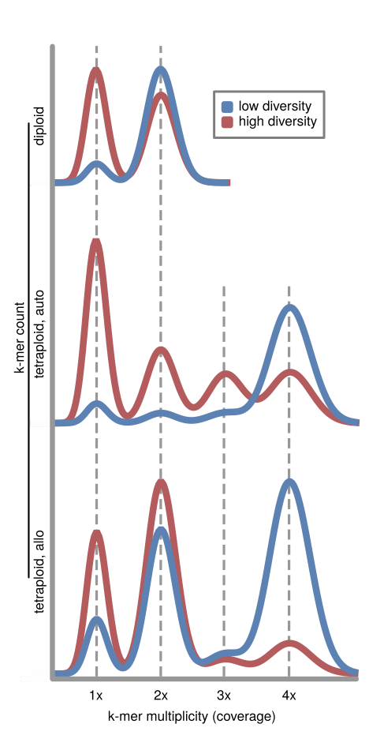

# Pipeline-for-Polyploid-Analysis


### （1）多倍体类型鉴定

#### 1、多倍体类型鉴定原理

针对四倍体的情况，GenomeScope 2.0会计算4种核苷酸杂合率（nucleotide heterozygosity rates），分别是aaaa，aaab，aabc，abcd。

- 对于同源四倍体（autotetraploid）来说：aaab > aabb
- 对于异源四倍体（allotetraploid）来说：aaab < aabb


在根据Tetmer对GenomeScope 2.0的分析结果做辅助验证。Tetmer鉴定同源、异源四倍体的原理如下图所示：

在low diversity情况下，同源四倍体一般在1×处有明显峰值，异源四倍体在2×处有明显峰值。




#### 2、软件安装

```shell
conda create -n polyploid
# Kmer counter安装
conda install jellyfish=2.3.0
conda install kmc=3.2.1
conda install r-base=3.6.3

# GenomeScope 2.0安装
# git clone https://github.com/tbenavi1/genomescope2.0.git
# 个人推荐使用加速后的镜像下载
git clone https://github.91chi.fun/https://github.com/tbenavi1/genomescope2.0.git
cd genomescope2.0
# 需先修改R_libs为当前虚拟环境下的R包安装路径
Rscript install.R
```


##### 额外

###### 如何加快git clone速度？

参考资料链接：https://www.jianshu.com/p/eed5ade1fb0c

###### 如何设置GenomeScope 2.0中的`install.R`的R包安装路径？

启动当前conda环境之后，进入R，输入：

```shell
.libPaths()
```


#### 3、多倍体类型鉴定分析流程

分析流程为：

- fastp过滤
- Jellyfish 2.3.0/KMC 3.2.1：count kmer histogram 
- GenomeScope 2.0 Analysis

##### 1.fastp过滤原始数据

SampleID需自行设置。

```shell
fastp -i input1.fq.gz -I input2.fq.gz -o input1.clean.fq.gz -O input2.clean.fq.gz --cut_tail --n_base_limit 3 --length_required 60 --correction --thread --html SampleID.html --json SampleID.json
```

##### 2.Jellyfish Kmer频数统计

```shell
# 1. count
jellyfish count -C -t 16 -m 21 -s 1000000000 <(zcat input1.clean.fq.gz) <(zcat input2.clean.fq.gz) -o SampleID.jf

# 2.histo
jellyfish histo -t 16 SampleID.jf > SampleID.histo
```

##### 3.GenomeScope 2.0：多倍体类型鉴定分析

```shell
Rscript /opt/biosoft/genomescope2.0/genomescope.R -i SampleID -o ./ -n 21mer.${SampleID} -p 4 -k 21

# 后续结果整理：
mkdir plot
cd plot
ls ../*.png | grep "21mer" | xargs -i mv {} ./
mkdir transformed_linear_plot
mv *transformed_linear_plot.png transformed_linear_plot/
mkdir linear_plot
mv *linear_plot.png linear_plot
cd ../ && mkdir 21_summary
ls *summary.txt | grep "21mer" | xargs -i mv {} 21_summary/
```

##### 4.Tetmer分析

输入文件为jellyfish histo的结果文件。

```shell
Rscript run_Tetmer.R --input $id --output ${id%.*}.pdf --kmer 21

# 后续结果整理：
mkdir 21_Tet_plot
mv *pdf 21_Tet_plot
```


### （2）核苷酸多样性 & Tajima's D & $$\text{F}_{\text{ST}}$$计算

该部分主要根据[ScanTools_ProtEvol](https://github.com/mbohutinska/ScanTools_ProtEvol)内的流程进行后续分析。

#### 0、输入数据准备

##### 1.分隔VCF文件

需先分Clade，使用gatk将原始VCF文件拆分。每一个Clade需设定一个args文件（一行一个sample，可参考仓库内的test.args）

该步骤脚本：`extract.Clades.sh`

示例代码如下：

```shell
gatk --java-options "-Xmx6G" SelectVariants -R ref.fasta -V all.input.vcf.gz -sn CladeX.args -O CladeX.vcf.gz
```

##### 2.VCF转table

该步骤脚本：`pop.non_coding.to.table.sh`

示例代码如下：

```shell
gatk VariantsToTable -V CladeX.vcf.gz -F CHROM -F POS -F REF -F AN -F DP -GF GT -O CladeX.table
```

##### 3.使用ScanTools_ProtEvol对table进行重编码

> 需要注意的是，ScanTools_ProtEvol的所有代码均在Python 3.5.1的环境下DEBUG过。因此保守起见，创建Python 3.5.1的conda环境。此后每次调用ScanTools均启用即可。
>
> ```shell
> module load anaconda3
> source activate
> conda create -n scantools python=3.5.1
> ```

该步骤脚本：`recode.sh`

示例代码如下：

```shell
perl -e 'while (<>) { s/chr/scaffold\_/; print; }' CladeX.table > CladeX_raw.table
cat CladeX_raw.table | tail -n+2 > CladeE.table
python3 ScanTools_ProtEvol/recode012.py -i CladeX.table -pop CladeX -o 01.ScanTools_ProtEvol/

# 示例结果文件：
CladeX.table.recode.txt
```


#### 1、核苷酸多样性（nucleotide diversity）和Tajima's D的计算

```shell
python3 ScanTools_ProtEvol/wpm.py -i CladeX.table.recode.txt -sampind 48 -o tmp -p CladeX
```

`wpm.py`参数：

```shell
-o     # 输出文件目录
-p     # 输出文件前缀
-ws    # 设置窗口大小
-ms    # 设置最少SNP数值
```

#### 2、核苷酸多样性（nucleotide diversity）和Tajima's D的计算结果的可视化

该步骤所使用脚本：`pi&tajimaD.R`


#### 3、$$\text{F}_\text{ST}$$计算

```shell
sort -k3,3 -k4,4n -m CladeX.table.recode.txt CladeY.table.recode.txt CladeZ.table.recode.txt > X.Y.Z_WS10000_MS2.concat.txt
python3 ScanTools_ProtEvol/bpm.py -i X.Y.Z_WS10000_MS2.concat.txt -o ../ -prefix X.Y.Z_WS10000_MS2 -ws 10000 -ms 2 -np 3
```

`bpm.py`参数：

```shell
-o       # 输出文件目录
-prefix  # 设置输出文件前缀
-ws      # 设置窗口大小
-ms      # 设置最少SNP数值
-np      # 设置populations数量
```


### （3）fastsimcoal2.6分析

#### 1.使用ScanTools_ProtEvol准备fastsimcoal2.6输入文件

该步骤脚本：`generateFSC2input.sh`

示例代码：

```shell
python3 ScanTools_ProtEvol/FSC2input.py -i 01.ScanTools_ProtEvol/X.Y.Z.recode.concat.txt -o ./ -prefix X.Y.Z -ws 10000 -bs 0 -np 3 -alpha true
# 结果文件：
X.Y.Z_DSFS.obs
```

以下为一些注意事项

- 分析多个Clade的群体历史，在使用`recode.py`将table文件重编码之后，需要先合并：

```shell
# e.g.
cat CladeX.table.recode.txt CladeY.table.recode.txt CladeZ.table.recode.txt > X.Y.Z.recode.concat.txt
```

- 同时，考虑到性染色体受到自然选择的情况并不会完全和常染色体一样。因此在进行比对之前，就已经将性染色体给筛除。在使用ScanTools_ProtEvol生成的`*.table.recode.txt`文件进行后续分析时会报错（因为这个工具包本身是针对*Arabidopsis arenosa*写的，不需要考虑染色体筛除的问题），所以我们就需要根据自己的情况进行修改。

修改目的：将染色体编号设置为没有间隔（e.g. 1,2,3,5是不可以的，但是1,2,3,4是可以的）

```shell
sed -i 's/scaffold_5/scaffold_4/' X.Y.Z.recode.concat.txt
```


#### 2.运行fastsimcoal2.6

该步骤所使用的脚本：

- `v{1,2,3}.generateHPC.cmd.py`
- `${PREFIX}.sh`

运行fastsimcoal2.6之间需要自行设置好群体历史模型文件（`.tpl`）和群体历史参数估计文件（`.est`）

**以模拟3个population & 不存在introgression的情况为例**。

```shell
# 生成工作路径 & 准备输入文件
mkdir 3clade.no.geneflow
cd 3clade.no.geneflow
cp /your_fsc26_input_path/X.Y.Z_DSFS.obs /your_workingpath/X.Y.Z_MSFS.obs

# 生成集群运行脚本
module load python
PREFIX=3clade.no.geneflow
python v3.generateHPC.cmd.py -p /your_fsc26_installation_path/fsc26 -t ${PREFIX}.tpl -e ${PREFIX}.est -input X.Y.Z_MSFS.obs -o ${PREFIX}.sh -rename ${PREFIX}_MSFS.obs -reps 50 -num_sim 100000 -num_ECM 40 -C 10

# 运行脚本
sbatch ${PREFIX}.sh
```


#### 3.选择最优模型

**以模拟3个population & 不存在introgression的情况为例**。

```shell
# (1) 选择最优best run
cd 3clade.no.geneflow
cp /scripts/fsc-selectbestrun.sh ./
chmod 777 fsc-selectbestrun.sh
./fsc-selectbestrun.sh
# 上述脚本会将结果打印到terminal

# (2) 计算模型AIC
cd bestrun/
cp /scripts/fsc-selectbestrun.sh ./
chmod 777 calculateAIC.sh
./calculateAIC.sh 3clade.no.geneflow
# cat 3clade.no.geneflow.AIC
```

需要注意的是，`calculateAIC.sh`需要根据自己生成的结果文件进行一些细节修改（该脚本使用的是R中的正则表达式）。


### （3）Treemix分析

##### 0.输入数据准备

该步骤示例脚本：`pop.MAF.4d.to.table.sh`

原始数据准备 & 转换参考ScanTools_ProtEvol的步骤即可，但是需要注意的是，table文件需以`_tm.table`结尾。

完成上述格式转换步骤之后，即可使用[TreeMix_input](https://github.com/mbohutinska/TreeMix_input)给出的脚本进行Treemix分析输入文件的生成：

```shell
conda activate scantools
python TreeMix_input/conversionTreemixMajda.py -i "allele_table/" -o "allele_table/"
less -S allele_table/treemix_input.table.gz | head -n 1 |tr " " "\n" | less -S >allele_table/poplist.txt
# 结果文件：
treemix_input.table.gz
```

#### 1.treemix运行

该步骤脚本：

- `maf4D_run_treemix_m20_bt10.sh`
- `rerun_randomseed_rerun_task_seperated_mafnCDS_run_treemix_m20_bt10.sh`

示例代码：

```shell
treemix -i allele_table/treemix_input.table.gz -root OG -k 500 -se -seed $RANDOM -m 0 -bootstrap -o rerun_randomseed_treemix_results_m20_bt10/migration_0_bt_1
```

#### 2.OptM判断最优m值

该步骤脚本：`select_bestM.R`（Treemix结果可视化也在其中）

示例代码：

```R
library(OptM)
dat <- optM("rerun_randomseed_treemix_results_m20_bt10/")
plot_optM(dat, method = "Evanno", plot = TRUE, pdf = "bestM.pdf")
```

#### 3.选择最优run

该步骤脚本：

- `maf4D_run_treemix_m13_seed30.sh`
- `mafnCDS_run_treemix_m17_seed30.sh`

```shell
treemix -i allele_table/treemix_input.table.gz -root OG -k 500 -se -seed $RANDOM -m 13 -o treemix_results_m13_run30/migration_13_run1
```


#### 参考资料

[1] GenomeScope 2.0 and Smudgeplot for reference-free profiling of polyploid genomes

[2] https://github.com/tbenavi1/genomescope2.0

[3] https://github.com/mbohutinska/ScanTools_ProtEvol

[4] https://github.com/mbohutinska/TreeMix_input

[5] https://speciationgenomics.github.io/fastsimcoal2/
