# 01) Review of Raw and Clean Data Quality

使用工具如下，

- `seqkit=2.1.0`
- `FastQC=0.11.9`
- `fastp=0.22.0`
- `trim-galore=0.6.7`

该部分分析所使用的代码以及参数如下，于各步中再进行详细的参数解析。

```shell
# 数据的简单查看
seqkit stats wtssRNA_seq.fastq
seqkit stats wtssRNA_seq_trimmed.fq
seqkit stats wtssRNA_seq.fastp.fastq

# 去除低质量的序列
trim_galore -j 8 -o 01.clean_data -q 15 --phred33 00.raw_data/wtssRNA_seq.fastq 2>trim_galore_rna.log
fastp -i 00.raw_data/wtssRNA_seq.fastq -o 01.clean_data/wtssRNA_seq.fastp.fastq -q 15 --n_base_limit 4

# FastQC的全面查看
fastqc -t 24 wtssRNA_seq.fastq
fastqc -t 24 wtssRNA_seq_trimmed.fq
fastqc -t 24 wtssRNA_seq.fastp.fastq
```

原始数据FastQC的概述如下，

- 根据原始数据的Quality Score判断得到对应的测序平台信息为Illumina 1.9
- reads总数为$$12236284$$
- GC%为$$ 41\%$$

原始数据的FastQC主要分析结果如下，

- Per base sequence quality，即序列测序质量统计
  根据如下结果可以得出，测序质量结果较差，存在碱基质量值小于5以及reads对应位置碱基质量值的中位数小于20的情况，且少有reads对应位置的碱基质量的平均值超过30（e.g. $$Q_{mean}>30$$）

  若以满足$$Q_{mean}≥Q_{20}$$为条件，则reads从第21位以后的碱基或序列都需要去除

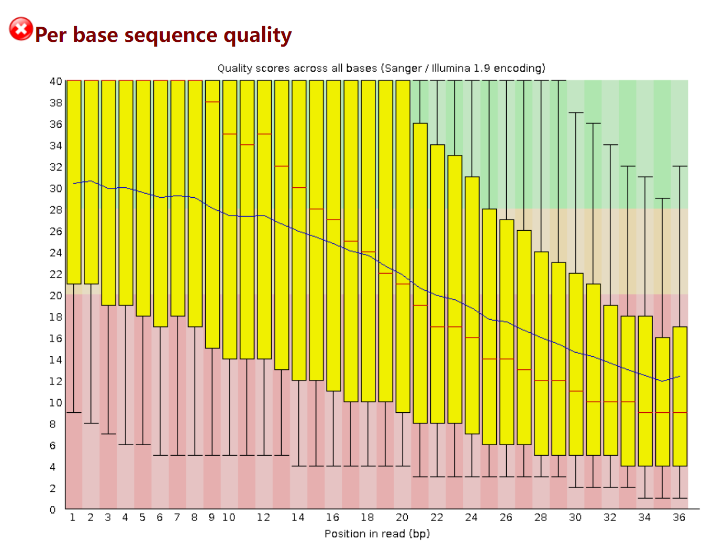


- Per tile sequence quality，即每一个tile的测序情况

  蓝色代表测序质量较高，暖色则代表测序质量较差，即可将出现暖色的tile在后续分析中去除

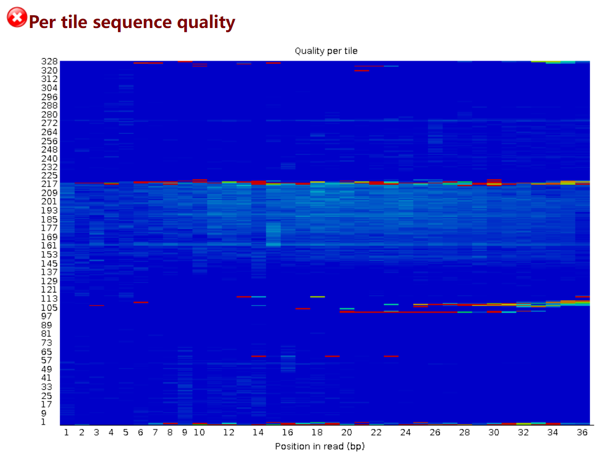

- Overrepresented sequences，

  如下图所示，输入数据中包含N 碱基数量过多的reads数量较多，需在后续的分析中进行去除。

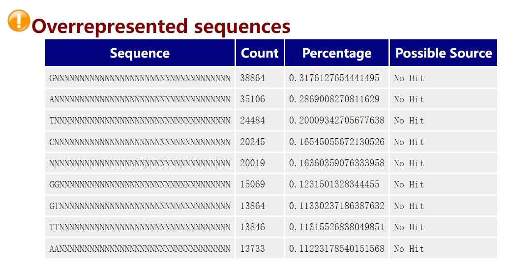

- Adapter Sequece，即测序数据中的接头序列检测。

  如下图所示，输入数据的reads中的adapter sequence已经被去除，后续分析中即可以不用考虑adapter序列对分析的影响。

  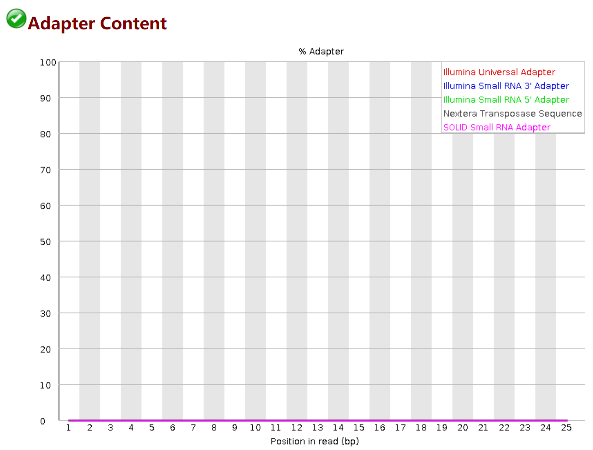

综上所示，输入数据需要针对Phred Quality Score、每条read中N bases的数量以及不合格的碱基占reads的百分比，对原始数据进行过滤。

使用的命令如下，

```shell
# trim-galore
trim_galore -j 8 -o 01.clean_data -q 15 --phred33 00.raw_data/wtssRNA_seq.fastq 2>trim_galore_rna.log
# fastp
fastp -i 00.raw_data/wtssRNA_seq.fastq -o 01.clean_data/wtssRNA_seq.fastp.fastq -q 15 --n_base_limit 3
```

参考之前的研究，选定参数如下，

- base quality $$> 15$$
- 每条read中，N碱基的数量不可以超过3个，减少后续mapping过程中出现与reference genome出现错配以及限制multi-alignment出现的概率
- 不合格的碱基占每条read的比率不能超过40%

从数据量大小的角度进行初步分析，

- fastp分析产生的结果文件`wtssRNA_seq.fastp.fastq`文件大小为$$1.4\,G$$，小于trim-galore过滤产生的文件（`wtssRNA_seq_trimmed.fq`为$$2.0\,G$$）

从Per base sequence quality的角度进行分析，

- 左右分别为经trim-galore、fastp过滤后，由FastQC分析得到的碱基测序质量的统计结果。从分析结果图上可以直观地得到，经设置更严格参数进行分析的fastp结果，其碱基测序质量整体略优于经一般参数trim-galore过滤得到的结果。

因此，后续分析采用上述参数过滤得到的测序数据进行分析。

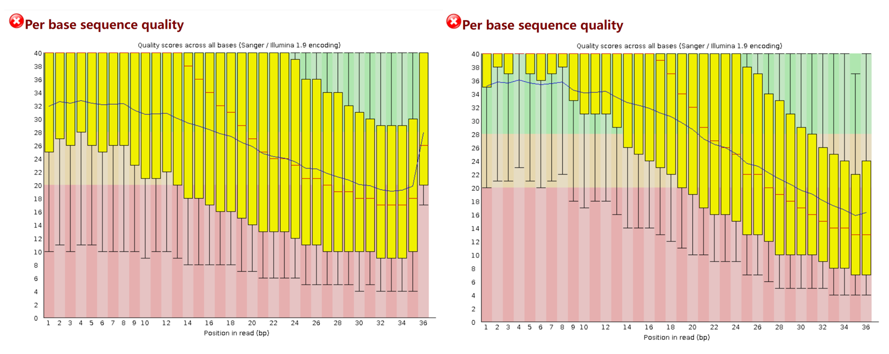


# 02) Reads Alignment

使用软件：`bowtie=1.0.0`

关于此处为什么选择`bowtie` 1.0版本进行分析？

- 原始数据包中已经提供了bowtie针对酿酒酵母基因组构建的索引文件，为节省计算量，因此选择bowtie

- 原始测序数据的reads长度均小于50，而bowtie采用的算法更适用于短序列比对。同时，也可以选择其他序列比对软件进行分析，e.g. STAR。示例代码如下，

  ```shell
  slid=$1
  prefix=${slid#*/}
  genomeDir=<index>
  outputPrefix=<outdir>
  
  # STAR中适用于短序列比对的参数
  params='--runThreadN 16
  outFilterScoreMinOverLread 0
  outFilterMatchNmin 16
  outFilterMatchNminOverLread 0
  outFilterMismatchNoverLmax 0.05
  seedSearchStartLmax 30
  alignIntronMax 1
  alignEndsType Local
  '
  
  STAR --genomeDir $genomeDir --readFilesIn $slid"_trimmed.fq" $params --outFileNamePrefix $outputPrefix/$prefix
  ```

分析所使用的代码以及参数解析如下，

- `--sam`，若不添加该参数，则默认输出bowtie规定的比对格式，不符合后续samtools处理的要求
- `-p`，设置所使用的线程数
- `-v`，reads与reference genome允许出现mismatch的数量。下述分析流程中不允许出现mismatch
- `-k`，每条read输出的alignment结果数。下述分析中只保留一条alignment信息，即primary alignment。
- `--best`，呈现最优比对结果。下述分析中只保留最优比对结果

```shell
bowtie --sam -p 4 -v 3 -k 1 --best -q 02.refgenome_bowtieindex/genome 01.clean_data/wtssRNA_seq.fastp.fastq 02.alignments/wtssRNA_seq.fastp.sam 2>bowtie_wtssRNA_seq.fastp.log &
```

SAM文件的统计结果，经由`03`排序后再进行分析。


# 03) Sorting and Indexing

使用软件：

- `samtools=1.9`

```shell
samtools sort -@ 6 -m 4G -O sam -o wtssRNA_seq.fastp.sorted.sam wtssRNA_seq.fastp.sam
```

以经过排序和经过排序的SAM文件，来对上述命令解析，

- unsorted的比对结果，

  ```shell
  SRR014850.74161 16      chrXIV
  SRR014850.74159 16      chrXIV
  SRR014850.74158 4       *
  SRR014850.74160 4       *
  SRR014850.74164 16      chrXIV
  SRR014850.74165 16      chrI
  SRR014850.74163 4       *
  ```

- sorted的比对结果，

  ```shell
  SRR014850.4046186       0       chrI
  SRR014850.6565149       16      chrI
  SRR014850.6069842       16      chrI
  SRR014850.2732032       16      chrI
  SRR014850.9090584       16      chrI
  SRR014850.3809624       0       chrI
  SRR014850.5777372       0       chrI
  ```

即排序是为了让序列回帖结果按照reference genome的排布顺序来显示（e.g. chrI，chrII）。


# 04) Quantification

使用软件：

- `featureCounts=2.0.1`

分析所使用的代码以及解析如下，

- `-t exon -g gene_id`，即选择GTF文件中的外显子信息，用于最终在gene水平上的read counts的计数，最终呈现在用户面前的是sample在gene层面的表达量。

```shell
featureCounts \
-T 16 \
-t exon \
-g gene_id \
-a 00.anno/sacCer2.gtf \
-o 03.featureCounts/wtssRNA_seq.mat \
02.alignments/wtssRNA_seq.fastp.sorted.sam 2>quan.log &
```


# 05) Enrichment Analysis

使用软件以及软件包：

- `R=3.6.3`
- `clusterProfiler 4.0`

在得到上述sample的表达量之后，先进行表达量标准化，即通过RPKM对raw counts进行转化。

计算公式如下，
$$
RPKM = number\,of\,Reads / ( gene\,Length/1000 * total\,NumReads/1,000,000 )
$$
完成标准化之后，挑选expression level前500的gene进行GO以及KEGG富集分析。

分析过程所使用的代码如下，

```R
# ------------------------------------------------------------------------------
# Description: Transform single sample read counts to RPKM and filtering analysis
# for GO & KEGG enrichment analysis
# Date: 2022-12-18
# ------------------------------------------------------------------------------
rm(list=ls())
options(stringsAsFactors = F)

# load data
counts <- read.delim('rna.mat', comment.char = '#', header = TRUE, sep = '\t')
names(counts)[7] <- "S1"
head(counts)

# RPKM
total.reads <- sum(counts[, 7])
rpkm.line <- function(line){
  return( as.numeric(line[7])/( as.numeric(line[6])/1000 * total.reads/1000000) )
}

counts$rpkm <- apply(counts, MARGIN = 1, FUN = rpkm.line)
head(counts)

# retrieve the top 500 level of genes
counts <- counts[order(counts$rpkm, decreasing = TRUE), ]
head(counts)
counts$Geneid[1:500]

# enrichment analysis
# BiocManager::install("org.Sc.sgd.db")
library(org.Sc.sgd.db)
library(clusterProfiler)


ego <- enrichGO(gene = counts$Geneid[1:500],
                OrgDb = org.Sc.sgd.db,
                ont = "all",
                pAdjustMethod = "BH",
                minGSSize = 10,
                pvalueCutoff = 0.05,
                keyType='ENSEMBL')

p1 <- barplot(ego, showCategory = 10)
p1
p2 <- dotplot(ego, showCategory = 10)
p2
```


## Results | GO enrichment analysis

由GO富集分析结果可以得到gene expression level排名前500的主要在peptide matabolic、peptide biosynthetic process以及translation等功能中呈现富集。上述3种功能的基因，主要分布于chromosome IV、chromosome XII以及chromosome VII上，且参与上述生物学过程的基因在功能上存在重叠，因此整合调控上述功能的核心基因集（core set），见Table 5.1。

同时，由于研究对象为酿酒酵母，其在工业中的主要应用为酿酒、面包制作等，即主要涉及到的功能有乙醇（$$C₂H₆O$$）生成、二氧化碳的生成。而在如下的GO富集分析中，也鉴定到了与carboxylic acid合成有关的基因，见Table 5.2。

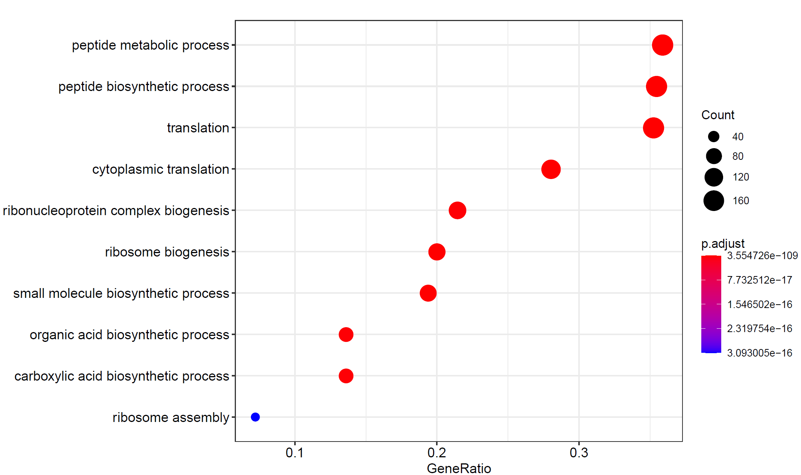


## Results | KEGG pathway enrichment analysis

KEGG通路的富集分析结果表明，基因主要在次级代谢物合成（Biosynthesis of secondary metabolites）、氨基酸合成以及核糖体相关通路中富集，主要结论于上一部分类似，不进行过多赘述。

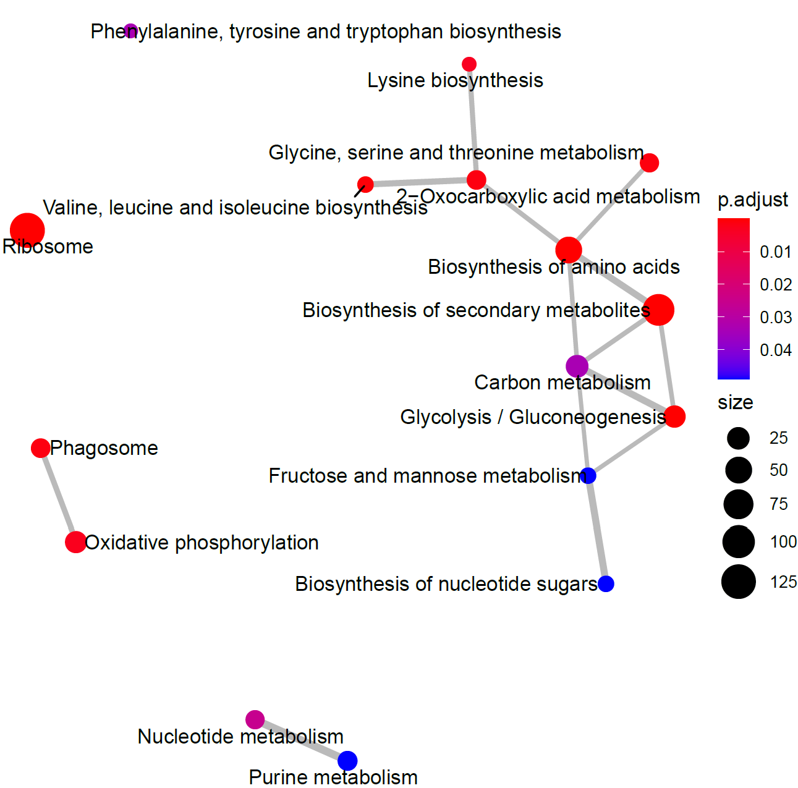


# 06) Read Depth of Specific Chromosome in Interest

绘制上述分析中得到的核心基因集所分布的染色体的Read Depth分布图，分别为

- Chromosome IV
- Chromosome XII
- Chromosome VII

同时还选取了线粒体的gene expression作为参照。基于以下结果得出核心基因集所在的染色体的gene expression level高于线粒体基因组的表达量。

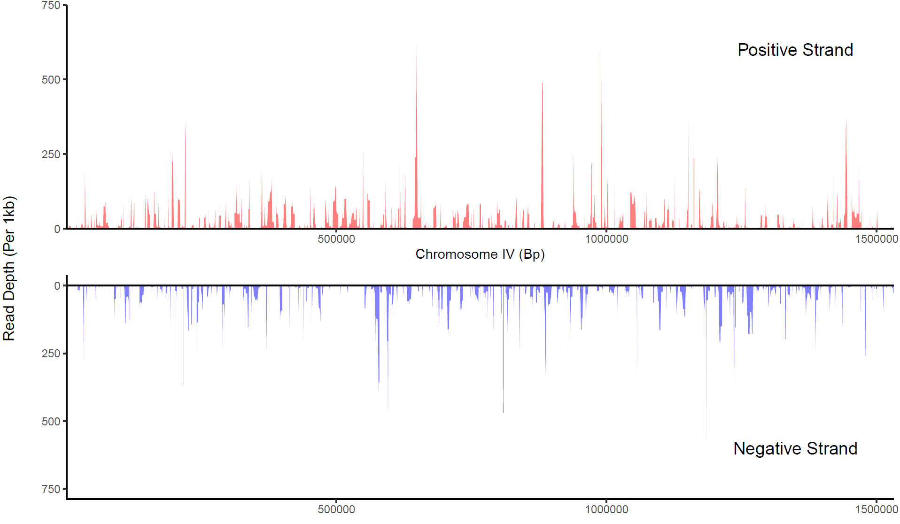


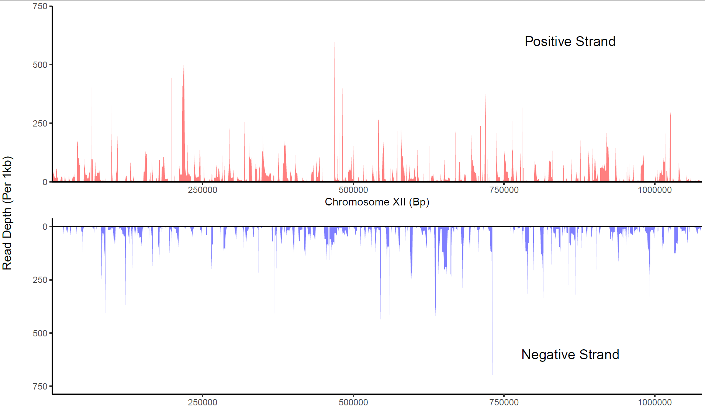


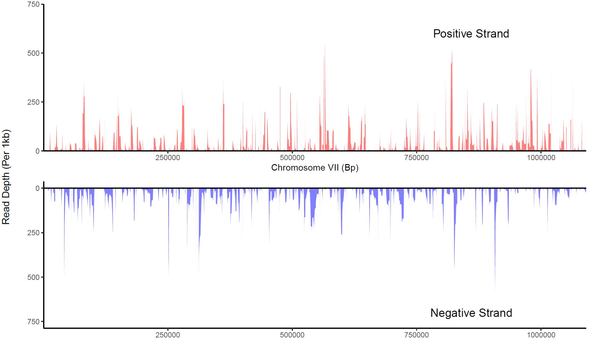


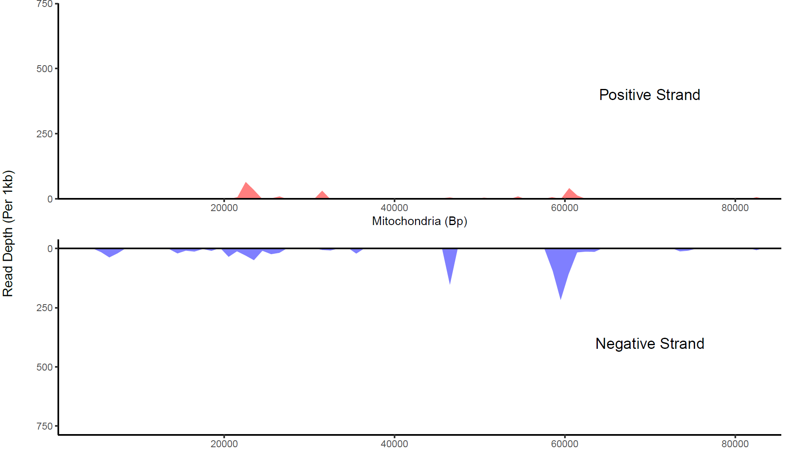


# 07) Distribution of Carboxylic Acid Biosynthesis Related Genes

由FigX可得chromosome VII包含了11个与羧酸合成有关的gene，而在chromosome V和III上相关gene数量分别为8和5，其他染色体上也存在着羧酸合成相关gene，分布较为均匀。

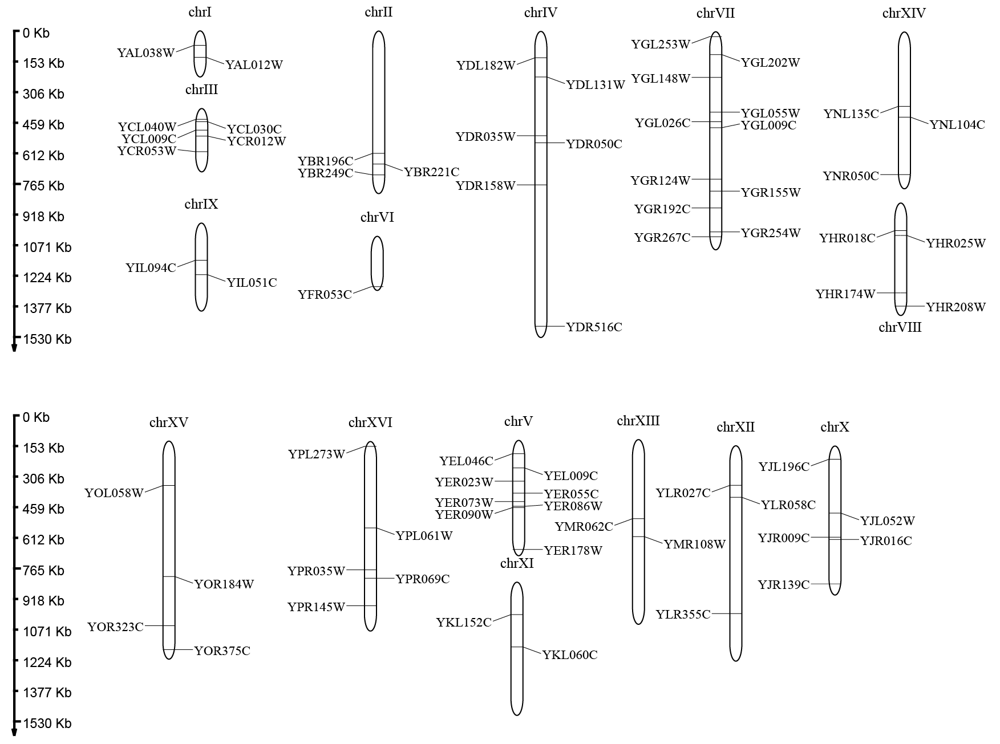

# 08) Overall Statistics of Variants

使用软件：

- `bcftools=1.5`

本次分析所使用的数据仅有一个样本，因此不采取GATK等较为复杂的variant calling软件。

```shell
bcftools mpileup -f 02.refgenome_bowtieindex/genome.fa wtssRNA_seq.sorted.bam | bcftools call -mv - > 04.variants/wtssRNA_seq.vcf
```


# Summary

最终结果分别编写了Shell格式和snakme格式的pipeline脚本，详见Github。


# Reference

[1] Luan, H., Meng, N., Fu, J., Chen, X., Xu, X., Feng, Q., Jiang, H., Dai, J., Yuan, X., Lu, Y. and Roberts, A.A., 2014. Genome-wide transcriptome and antioxidant analyses on gamma-irradiated phases of Deinococcus radiodurans R1. *PloS one*, *9*(1), p.e85649.

[2] Achkar, N.P., Cho, S.K., Poulsen, C., Arce, A.L., Re, D.A., Giudicatti, A.J., Karayekov, E., Ryu, M.Y., Choi, S.W., Harholt, J. and Casal, J.J., 2018. A quick HYL1-dependent reactivation of microRNA production is required for a proper developmental response after extended periods of light deprivation. *Developmental cell*, *46*(2), pp.236-247.

[3] Vallejo, B., Peltier, E., Garrigós, V., Matallana, E., Marullo, P. and Aranda, A., 2020. Role of Saccharomyces cerevisiae nutrient signaling pathways during winemaking: a phenomics approach. Frontiers in bioengineering and biotechnology, 8, p.853.